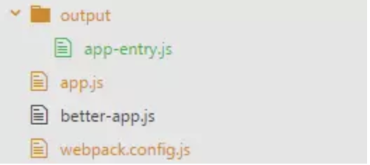
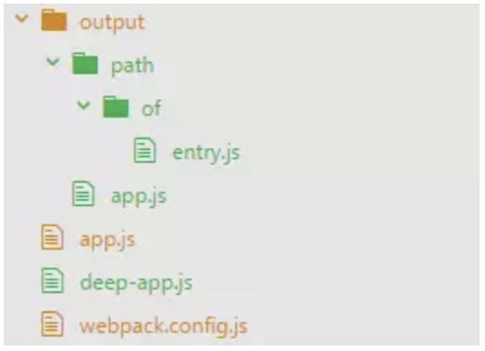

```javascript
/**
 * 获得绝对路径
 * @method resolve
 * @param  {String} dir 相对于本文件的路径
 * @return {String}     绝对路径
 */
function resolve(dir) {
  return path.join(__dirname, '..', dir)
}

module.exports = {
    // [1] 'development'或'production'或'none'
    mode: 'development',
    // [2] webpack编译时的基础路径
    context: path.resolve('./src'),
    // [3][4] 入口配置项
    entry: {
        app: './main.js'
    },
    // 出口配置项，webpack输出bundles的配置，默认值为./dist
    output: {
        // [5] 编译输出的文件名
        filename: '[name].min.js',
        // [6] 非入口(non-entry) chunk 文件的名称
        chunkFilename: '[name].chunk.js',
        // 编译输出的静态资源根路径。类型：字符串；格式：绝对路径。支持字符串模版。
        path: config.build.assetsRoot,
        // [7] 正式发布环境下编译输出的上线路径的根路径
        publicPath: process.env.NODE_ENV === 'production' ?
            config.build.assetsPublicPath : config.dev.assetsPublicPath,
        // [8]* 该值取决于如何配置libraryTarget。默认值为var
        library: '[name]',
        // [8]* 模块以何种规范打包
        libraryTarget: 'umd',
        // 在使用libraryTarget: "umd"时，设置为true，则在UMD库中使用命名的AMD模块，否则采用匿名定义
        umdNamedDefine: true,
        // 允许在运行时选择全局对象引用(webpack4新特性)
        globalObject: 'this'
    },
    // [9] 控制是否生成，或如何生成sourceMap
    devtool: 'eval-source-map',
    // 是否展示错误通知。当参数为true时，需要FriendlyErrorsPlugin插件的加持
    notifyOnErrors: true,
    // [13] 对webpack-dev-server的配置
    devServer: {
        // 服务器主机号
        host: 'localhost',
        // 指定开启服务的端口号
        port: 8080,
        // 是否在启动服务时，使用系统默认浏览器打开项目
        open: false,
        // [7] 打包生成静态文件的位置（内存中）
        publicPath: '/',
        // 配置在客户端的日志等级，影响开发者工具中控制台看到的日志内容。可选值：none/error/warning/info
        // info为输出所有日志类型；none为不输出任何日志
        clientLogLevel: 'warning',
        // [10] 是否对所有服务器资源启用gzip压缩，默认为false
        compress: true,
        // [11] 指定服务器的资源的根目录。默认为项目根目录。
        contentBase: false,
        // 服务器针对命中路由返回相应的HTML文件。例如可做404页面的定向跳转。使用正则匹配命中路由。
        historyApiFallback: {
            rewrites: [
                { from: /.*/, to: path.posix.join('/', 'index.html') }
            ]
        },
        // 编译出错时，是否在浏览器页面上显示错误
        overlay: {
            warnings: false,
            errors: true
        },
        // 用来控制编译的时候shell上的输出内容，可选值为"errors-only"，"minimal"，"normal"，"verbose"
        // 当不配置时很多没有用的信息会被打印出来。设置为"errors-only"时，只在编译的时候打印错误信息
        stats: "errors-only",
        // 与devServer.stats属于同种类型的配置信息
        // 当参数为true时，控制台只输出第一次编译的信息，当保存再编译后不会输出信息（包括错误和警告）
        // 当参数为true时，编译信息的输出依赖FriendlyErrorsPlugin插件的加持
        quiet: true,
        // webpack可以监听文件变化，发生变化时重新编译。该参数默认为true，表示启用监听模式。
        watch: true,
        // 文件更改的监控配置，用来制定watch模式
        watchOptions: {
            // 是否开启轮询（以毫秒为单位监听文件变动）
            poll: false,
            // 监听大量文件会造成CPU或内存的浪费，该配置可忽略一些不需要监听的文件，例如：'node_modules'
            ignored: '/node_modules/'
        },
        // [12] 是否启用模块热更替（HMR）功能，若为true则要在plugin中添加HotModulesReplacePlugin插件
        hot: true,
        // [12] 是否开启自动刷新功能，默认为true
        inline: true,
        // 解决跨域问题，使用http-proxy-middleware插件
        proxy: {
            // 捕获API的标志，用于代理匹配
            '/api': {
                // 目标服务器 host
                target: 'http://www.example.org',
                // 默认false，是否需要改变原始主机头为目标URL。target是域名的话，需要这个参数。
                changeOrigin: true,
                // 是否代理websockets
                ws: true,
                // 设置支持https协议的代理
                secure: false,
                // 重写请求，比如我们源访问的是api/old-path，那么请求会被解析为/api/new-path
                pathRewrite: {
                    '^/api/old-path' : '/api/new-path',
                    '^/api/remove/path' : '/path'
                },
                router: {
                    // 如果请求主机 == 'dev.localhost:3000',
                    // 重写目标服务器 'http://www.example.org' 为 'http://localhost:8000'
                    'dev.localhost:3000' : 'http://localhost:8000'
                }
            }
        },
    },
    // webpack4 提供了根据 mode值针对项目优化的默认配置。
    // 而这些配置是在optimization设定的，根据项目可以自定义这些配置。
    optimization: {
        // [1] 取代插件中的 new webpack.NamedModulesPlugin()
        namedModules: true,
        // [1] 取代插件中的 new webpack.NamedChunkPlugin()
        namedChunks: true,
        // [1] 阻止报错
        noEmitOnErrors: true,
        // [1] 预编译，作用域提升
        concatenateModules: true,
        // 若mode为production，则该项默认为true，执行默认压缩js。
        // webpack会调用terser-webpack-plugin压缩文件
        minimize: true,
        // 配置第三方插件
        minimizer: 
            mode === "development"
                ? []
                : [
                    // 自定义uglifyjs-webpack-plugin
                    new UglifyJsPlugin({
                        // 测试匹配文件
                        test: /\.js(\?.*)?$/i,
                        // 排除的文件，用正则表示
                        exclude: /\.min\.js$/,
                        // 是否启用缓存
                        cache: true,
                        // 使用多进程并行运行来提高构建速度
                        parallel: true,
                        // cheap-source-map选项不生效
                        sourceMap: mode === "development",
                        // 压缩选项
                        uglifyOptions: {
                            compress: {
                                // 在UglifyJs删除没有用到的代码时不输出警告
                                warnings: false,
                                // 删除所有的 `console` 语句，可以兼容ie浏览器。默认为false。
                                drop_console: true,
                                // 内嵌定义了但是只用到一次的变量，默认为false。例如：
                                // var x = 5; y = x 转换成 y = 5
                                collapse_vars: true,
                                // 提取出出现多次但是没有定义成变量去引用的静态值，默认为false。例如：
                                // x = 'Hello'; y = 'Hello' 转为var a = 'Hello'; x = a; y = b
                                reduce_vars: true,
                            },
                            output: {
                                // 是否输出可读性较强的代码，即会保留空格和制表符。默认为true
                                beautify: false,
                                // 是否删除所有的注释，默认为true
                                comments: false,
                            }
                        }
                    }),
                    // 生产环境对css进行压缩和优化。
                    new OptimizeCSSAssetsPlugin({
                        // 正则表达式，用于匹配需要优化或者压缩的资源名。默认值是 /\.css$/g
                        assetNameRegExp: /\.optimize\.css$/g,
                        // 用于压缩和优化CSS的处理器，默认是 cssnano。是一个函数
                        // 应该按照cssnano.process接口(接受一个CSS和options参数，返回一个Promise)
                        cssProcessor: require('cssnano'),
                        // 传递给cssProcessor的选项，压缩规则
                        cssProcessorOptions: {
                            // 对注释的处理
                            discardComments: {
                                removeAll: true 
                            },
                            map: {
                                // 不生成内联映射,这样配置就会生成一个source-map文件
                                inline: false,
                                // 向css文件添加source-map路径注释
                                // 如果没有此项压缩后的css会去除source-map路径注释
                                annotation: true
                            }
                        },
                        // 表示插件能够在console中打印信息，默认值是true
                        canPrint: true
                    })
                ],
        // [14] webpack4提供的模块拆分的方法。官方提供的默认值，不建议修改。
        splitChunks: {
            // [15] 通过改值来判断哪些模块会被提取为公共模块。可选三个参数：async | initial | all
            // 默认为async，表示只会提取异步加载模块的公共代码。initial表示只会提取初始入口模块的代码。
            chunks: "async",
            // 模块大于30k会被抽离到公共模块
            minSize: 30000,
            // 模块出现1次就会被抽离到公共模块
            minChunks: 1,
            // 异步模块，一次最多只能被加载5个
            maxAsyncRequests: 5,
            // 入口模块最多只能加载3个
            maxInitialRequests: 3,
            // 打包分隔符
            automaticNameDelimiter: '~',
            // 控制切割之后代码块的命名
            // true表示自动根据切割之前的代码块和缓存组键值(key)自动分配命名,否则传入一个String或function
            // 命名与入口名称相同时,入口将会被移除
            name: true,
            // [16] 用来表示会提取到公共模块的集合，即，提取规则
            // 默认设置了分割node_modules和公用模块(即，vendors和default缓存组)
            // cacheGroups会继承和覆盖splitChunks的配置项
            // 但是 test、priorty和reuseExistingChunk只能用于配置缓存组
            cacheGroups: {
                // 所有重复引用至少两次的代码，会被分配到default的缓存组
                default: {
                    // 将至少有两个chunk引入的模块进行拆分
                    minChunks: 2,
                    // 优先级（如果一个模块满足了多个缓存组的条件，则按优先级分配）
                    priority: -20,
                    // 是否使用已有的chunk
                    // 为true时，表示如果当前的 chunk 包含的模块已经被抽取出去了，那么将不会重新生成新的
                    reuseExistingChunk: true,
                },
                // 所有来自node_modules的模块分配到一个叫vendors的缓存组
                vendors: {
                    // 用于控制哪些模块被这个缓存组匹配到。可传参数类型：RegExp、String和Function
                    // 表示只筛选从node_modules文件夹下引入的模块，所有第三方模块会被拆分出来
                    test: /[\\/]node_modules[\\/]/,
                    priority: -10
                },
                common: {
                    // 抽取的chunk的名字
                    name: 'common',
                    // 每项最好都要加上chunks参数，不然可能打包不出想要的东西
                    chunks: 'initial',
                    test: /[\\/]node_modules[\\/]/,
                    // 默认是30KB（注意这个体积是压缩之前的）在小于30kb的情况下一定要设置一个值
                    miniSize: 20,
                    priority: 10,
                    minChunks: 2,
                    reuseExistingChunk: true,
                    // 如果没有设置minSize，则据此判断是否使用上层的minSize
                    // true：则使用0，false：使用上层minSize
                    enforce: true
                }
            }
        },
        // [17] 优化持久化缓存
        // ###confused 3###
        runtimeChunk: true
    },
    plugins: {
        // (dev)(pro) 请确保引入这个插件！
        // 它的职责是将你定义过的其它规则复制并应用到 .vue 文件里相应语言的块。
        // 例如：如果你有一条匹配 /\.js$/ 的规则，那么它会应用到 .vue 文件里的 <script> 块
        new VueLoaderPlugin(),
        // (dev) 生成html文件，并动态注入css和js
        new HtmlWebpackPlugin({
            // 生成的html名称
            filename: 'index.html',
            // 指定模版，一个html文件（在该模版基础上动态加入css和js）
            template: 'index.html',
            // 资源的注入位置，可选参数：true | body | head | false
            // 当为true和body时，script标签位于html文件的body底部
            inject: true,
            // 如果使用webpack4将该配置项设置为'none'
            chunksSortMode: 'none',
            // 是否对生成的html文件启用压缩，默认为false
            minify: {
                //是否大小写敏感
                caseSensitive:false,
                //是否去除空格
                collapseWhitespace:true,
                // 去掉属性引用
                removeAttributeQuotes:true,
                //去注释
                removeComments:true
            }
        }),
        // (pro) 通过style-loader解析出来的css文件将会以内联样式注入到html中
        // 该插件能将css文件单独提取出来，成为外部样式表。合并多个css为一个css
        // 只在生产环境下使用 CSS 提取，这将便于你在开发环境下进行热重载
        // 用于webpack4以上的版本，以下的版本使用extract-text-webpack-plugin
        new MiniCssExtractPlugin({
            // 配置和webpack.output的配置很像
            filename: 'css/[name].min.css',
            chunkFilename: "[id].css"
        }),
        // (dev) 更好的在终端看到webpack运行时的错误和警告等信息。提升开发体验。
        new FriendlyErrorsPlugin({
            compilationSuccessInfo: {
                messages: [`Your application is running here: http://${devServer.host}:${port}`],
            },
            onErrors: config.dev.notifyOnErrors
                ? () => {
                        const notifier = require('node-notifier')
                        
                        return (severity, errors) => {
                            if (severity !== 'error') return
                            
                            const error = errors[0]
                            const filename = error.file && error.file.split('!').pop()
                            
                            notifier.notify({
                                title: packageConfig.name,
                                message: severity + ': ' + error.name,
                                subtitle: filename || '',
                                icon: path.join(__dirname, 'logo.png')
                            })
                        }
                    }
                : undefined
        })),
        // (dev) 启动热更替时，配置的插件
        new webpack.HotModuleReplacementPlugin(),
        // (dev) 固定chunk id (优化缓存)
		// 另一种配置方式是在optimiza.namedChunks中添加。
        new webpack.NamedChunkPlugin(),
        // (dev) 启动热更替时，可以显示模块的相对路径(开发环境对module id的固定，优化缓存)
        // 另一种配置方式是在optimiza.namedModules中添加。
		new webpack.NamedModulesPlugin(),
        // (pro) 生产环境对module id 的固定 (优化缓存)
        new webpack.HashedModuleIdsPlugin(),
        // (pro) 生产环境对css进行压缩和优化。另一种配置方式是在optimiza.minimizer中添加。
        new OptimizeCSSAssetsPlugin(),
        // (pro) 生产环境对js进行压缩和优化。另一种配置方式是在optimiza.minimizer中添加。
        new UglifyJsPlugin(),
        // 在编译出现错误时，使用 NoEmitOnErrorsPlugin 来跳过输出阶段。这样可以确保输出资源不会包含错误。
        // (pro) 另一种配置方式是设optimiza.noEmitOnErrors为true
        new webpack.NoEmitOnErrorsPlugin(),
        // 预编译，作用域提升。（！！！我是真的看不懂这个模块的功能啊，救救孩子吧）
        // (pro) 另一种配置方式是设optimiza.concatenateModules为true
        new webpack.optimize.ModuleConcatenationPlugin()
    },
    resolve: {
        // 自动补全的扩展名
        extensions: ['.js', '.vue', '.json'],
        // 路径别名
        alias: {
            // 例如 import Vue from 'vue'，会自动到 'vue/dist/vue.common.js'中寻找
            'vue$': 'vue/dist/vue.esm.js',
            '@': resolve('src'),
        }
    },
    module: {
        rules: [{
            // 审查 js 和 vue 文件
            test: /\.(js|vue)$/,
            loader: 'eslint-loader',
            // 表示预先处理
            enforce: "pre",
            include: [resolve('src'), resolve('test')],
            options: {
                formatter: require('eslint-friendly-formatter')
            }
        },
        {
            // 处理 vue文件
            // 请确保webpack配置中添加 Vue Loader 的插件
            test: /\.vue$/,
            loader: 'vue-loader',
            options: vueLoaderConfig
        },
        {
            // 编译 js
            test: /\.js$/,
            loader: 'babel-loader',
            include: [resolve('src'), resolve('test')]
        },
        {
            // 编译css
            test: /\.css$/,
            use: [
                // 只在生产环境下使用 CSS 提取，这将便于你在开发环境下进行热重载
                process.env.NODE_ENV !== 'production'
                    ? 'vue-style-loader'
                    : MiniCssExtractPlugin.loader,
                {
                    loader: 'css-loader',
                    options: {
                        // 解析css文件后，在浏览器调试
                        'source-map': true,
                        // css-loader中内置了cssnano，通过压缩css，以达到提升加载速度和代码混淆的作用
                        // cssnano 能理解 CSS 代码的含义，而不仅仅是删掉空格
                        // 例如：margin: 10px 20px 10px 20px 被压缩成 margin: 10px 20px；
                        // 例如：color: #ff0000 被压缩成 color:red
                        // 若使用了OptimizeCSSAssetsPlugin则该项不需要配置
                        minimize: process.env.NODE_ENV === 'production'
                    }
                }
             ]
        },
        {
            // 处理图片文件
            test: /\.(png|jpe?g|gif|svg)(\?.*)?$/,
            loader: 'url-loader',
            query: {
                limit: 10000,
                name: utils.assetsPath('img/[name].[hash:7].[ext]')
            }
        },
        {
            // 处理字体文件
            test: /\.(woff2?|eot|ttf|otf)(\?.*)?$/,
            loader: 'url-loader',
            query: {
                limit: 10000,
                name: utils.assetsPath('fonts/[name].[hash:7].[ext]')
            }
        }]
    }
}
```


### 附录

1. 该配置为webpack4新增属性，创建全局变量`process.env.NODE_ENV`，表示当前为开发环境还是生产环境，使`webpack`使用相应的内置优化，默认值为`'production'`。

   + 为`'development'`时:

     不提供压缩，`process.env.NODE_ENV`设置为`development`；

     默认`devtool`为`eval`;

     启用`NamedChunksPlugin`和`NamedModulesPlugin`（即，省略了给所有模块(源文件)和块(构建输出文件)命名的过程）

     ```javascript
     // webpack.development.config.js 改动
     module.exports = {
     + mode: 'development'
         
     - plugins: [
     - new webpack.NamedModulesPlugin(), // 参见dependencies/webpackPlugin.md
     - new webpack.NamedChunksPlugin(), // 参见dependencies/webpackPlugin.md
     - new webpack.DefinePlugin({ "process.env.NODE_ENV": JSON.stringify("development") }),
     - ]
     }
     ```

     

   + 为`'production'`时：

     提供压缩，`process.env.NODE_ENV`设置为production`；

     启用`FlagDependencyUsagePlugi`,`FlagIncludedChunksPlugi`, `ModuleConcatenationPlugin`, `NoEmitOnErrorsPlugin`, `OccurrenceOrderPlugin`, `SideEffectsFlagPlugin` 和 `UglifyJsPlugin`

     ```javascript
     // webpack.production.config.js 改动
     module.exports = {
     + mode: 'production',
     - plugins: [
     -  new UglifyJsPlugin(/* ... */), // a
     -  new webpack.DefinePlugin({ "process.env.NODE_ENV": JSON.stringify("production") }),
     -  new webpack.optimize.ModuleConcatenationPlugin(), // 预编译，作用域提升
     -  new webpack.NoEmitOnErrorsPlugin() // 阻止报错
     - ]
     }
     
     // a. UglifyJsPlugin这个插件也可以在optimize.minimizer中配置
     // FlagDependencyUsagePlugin: 标记没有用到的依赖
     // FlagIncludedChunksPlugin: 检测并标记模块之间的从属关系
     // OccurrenceOrderPlugin: 按照调用次数来给chunks排序, 这样可以实现最优的构建输出
     // SideEffectsFlagPlugin: 参见dependencies/webpackPlugin.md
     ```

     

   `Tips:`只设置`NODE_ENV`，则不会自动设置`mode`类型

2. 默认为执行启动`webpack`时所在的工作目录。入口起点（entry）会**相对于此路径查找**：

   ```javascript
   // 若原本配置为
   module.exports ={
       entry: './src/main.js'
   }
   // 当配置更改context默认配置后，则原本的entry配置应更改为
   module.exports ={
       context: path.resolve('./src'),
       // 相对于context的路径进行查找，此时main.js就在此目录下，故应使用 当前目录‘./‘
       entry: './main.js'
   }
   ```

   

   `Tips:`在进行`context`配置时，应设为**绝对路径**

3. `entry`接受三种形式的值：字符串、数组、对象

   + 对象形式（对象中的每个键值对都代表一个入口文件，故多页面配置时肯定使用对象形式）：

     ```javascript
     entry: {
         <key>: <value>
         ...
     }
     ```

     + key: 

       > **普通字符串**：可以为比如：`'app', 'main', 'entry-1'`等。并且对应着`output.filename`配置中的`[name]`变量
       >
       > ```javascript
       > entry: {
       >     'app-entry': './app.js'
       > },
       > output: {
       >     path: './output',
       >     filename: '[name].js'
       > }
       > ```
       >
       > 以上配置打包后生成：
       >
       > 

       >**路径字符串**：此时webpack会自动生成路径目录，并将路径的最后作为`[name]`
       >
       >```javascript
       >entry: {
       >    'path/of/entry': './deep-app.js',
       >    'app': './app.js'
       >},
       >output: {
       >    path: './output',
       >    filename: '[name].js'
       >}
       >```
       >
       >以上配置打包后生成：
       >
       >
       >
       >

     + value

       >**字符串**：必须是合理的noderequire函数参数字符串

       >**数组**：数组的元素也应是合理的noderequire函数参数字符串。数组的文件一般是没有相互依赖关系的，但是由于某种原因又必须打包在一起，比如：
       >
       >```javascript
       >entry: {
       >    vendor: ['jquery', 'lodash']
       >}
       >```

   + 字符串形式

     ```javascript
     entry: './app.js'
     
     // 以上方式等同于以下对象模式
     entry: {
         main: './app.js'
     }
     ```

   + 数组形式

     ```javascript
     entry: ['./app.js', 'lodash']
     
     // 以上方式等同于以下对象模式
     entry: {
         main: ['./app.js', 'lodash']
     }
     ```

4. 配置动态`entry`

   若`entry`的配置中包含非静态的值，则可以将`entry`设置为一个函数，动态的返回`[3]`中所说的配置：

   ```javascript
   ###confused 1###
   // 同步函数
   entry: () => {
       return {
           '变量a': './pages/变量a'
       }
   }
   
   // 异步函数
   entry: () => {
       return new Promise((resolve) => {
           resolve({
               '变量a': './pages/变量a'
           })
       })
   }
   ```

   + `Tips:`当结合 `output.library `选项时：如果传入数组，则只导出最后一项。

5. 如果只有一个输出文件，可以写成静态名称。但在一般项目开发时，若不分块打包，则`bundle.js`的体积会很大

   + 创建`bundle`的方式包含：入口起点（`entry`）、代码拆分（`code spliting`）、插件提取（`plugin`）

   + 可以通过以下方式来赋予`bundle`唯一的名称：

     ```javascript
     // 使用入口名称 (entry)
     output:{
     	filename: "[name].bundle.js"
     }
     ```

     ```javascript
     // 使用内部chunk id
     // 关于chunk id 请参见dependencies/webpackPlugin.md [3] 
     output:{
     	filename: "[id].bundle.js"
     }
     ```

     ```javascript
     // 使用每次构建过程中产生的唯一的hash (hash)
     output:{
     	filename: "[name].[hash].bundle.js"
     }
     ```

     ```javascript
     // 使用基于每个chunk内容的hash (chunkhash)
     output:{
     	filename: "[chunkhash].bundle.js"
     }
     ```

     + `Tips:`关于`hash / chunkhash / contenthash`三者：

       >**`hash`**:
       >
       >整个项目的`hash`值是相同的，即，每次修改任何一个文件，所有文件名的`hash`都将改变。所以一旦修改了任何一个文件，整个项目的文件缓存都将失败，对于没有做修改的模块而言这样的处理是不合理的。（所以就有了`chunkhash`）

       > **`chunkhash`**: 
       >
       > + 哪个文件内容被修改哪个文件的文件名`hash`值改变，同一个模块的文件`chunkhash`相同。
       > + 根据不同的入口（`entry`）文件进行依赖文件解析和构建对应的`chunk`，生成对应的`hash`值。在生产环境中将公共库与程序入库组件分开，进行单独打包构建，之后采用`chunkhash`的方式生成`hash`值，只要不修改公用库的代码就可以保证其`hash`值不受影响。
       > + 由于采用`chunkhash`的方式，所以项目主入口文件`main.js`及其依赖的`main.css`被打入了同一个模块中，故两者`chunkhash`相同。这样就回导致，如果`css`或`js`文件内容改变，那么与其关联文件的`hash`值都会改变，但其内容并没发生变化。还是没有达到缓存的目的。
       > + 另一种情况：若对`css`文件进行了提取操作，而`css`文件采用`chunhash`的方式命名时，其他代码不做修改，即使对相应模块的`css`做了修改，产生的文件`chunkhash`不会改变。因为`chunkhash`是根据`entry chunk`计算出，而此时`css`部分已经做了抽离，故产生的`chunkhash`与`css`文件修改前相同。即，文件内容发生了修改，但是`chunkhash`并没有改变。

       > **`contenthash`**：
       >
       > + 由文件内容产生的`hash`值，内容不同，产生的`contenthash`不同。
       > + 通常情况下，把项目中的`css`抽离出来成为单独的文件加以引用，`css`的文件名最好使用`contenthash`

6. 使用场景：

   + 在按需加载（异步）模块的时候，即，路由懒加载。异步加载的模块时没有被列在entry中的

   + 例如：

     ```javascript
     {
         entry: {
             "index": "pages/index.jsx"
         },
         output: {
             filename: "[name].min.js",
             chunkFilename: "[name].min.js"
         }
     }
     const myModel = r => require.ensure([], () => r(require('./myVue.vue')), 'myModel')
     
     // 通过filename的配置输出的文件是：index.min.js
     // 异步加载的模块时要以文件的形式加载，所以这时生成的文件名是以chunkFilename的配置为准，其输出为myModel.min.js
     ```

7. 两者关系：

   + `output.publicPath`

   > 使`webpack`在打包时，可动态配置修改项目中`uri`的相对值，即，补全引用资源的相对路径。
   >
   > 如果项目中包含`url`引用资源，则一定要配置该项。
   >
   > dev环境打包生成静态资源的位置

   + `devSever.publicPath`

     > `dev`服务中补全`url`引用资源时使用的值，以及服务或模块打包的地址。
     >
     > 该值要以`/`结尾。
     >
     > 该项不配置时，默认使用`output.publicPath`的值；配置时，该值为指定路径。

   + `Tips:` 当无`devSever.publicPath`配置项时，`web pack-dev-server`会打包到`output.publicPath`的目录下；当有`devSever.publicPath`配置项时，打包到该值目录下。

8. 当使用`webpack`去构建一个可以被其他模块导入使用的库时，需要使用到`libraryTarget / library`这两个变量，他们通常搭配在**生产环境**使用。
   
   + `output.library`

     > 该值将会作为导出库的名称。
     
   + `output.libraryTarget`

     > 配置以何种方式导出库。默认值为`var`，可选变量如下：
     >
     > + `var`: 编写的库将通过`var`的方式被赋值给通过`output.library`指定名称的变量
     >
     >   ```javascript
     >   // 配置如下：
     >   module.exports = {
     >     //...
     >     output: {
     >       library: 'LibraryName',
     >       libraryTarget: 'var'
     >     }
     >   };
     >   
     >   // 1.则输出和使用的代码如下
     >   // Webpack 输出的代码。其中lib_code代指导出库的代码内容，是一个有返回值的自执行函数
     >   var LibraryName = lib_code;
     >   // 使用库的方法
     >   LibraryName.doSomething();
     >   
     >   // 2. 若output.library为空，则将直接输出
     >   lib_code
     >   ```
     >
     > + `commonjs`: 以`CommonJs`规范导出，将导出库分配给`exports`对象
     >
     >   ```javascript
     >   // 配置如下：
     >   module.exports = {
     >     //...
     >     output: {
     >       library: 'LibraryName'
     >       libraryTarget: 'commonjs'
     >     }
     >   };
     >   
     >   // 则输出和使用的代码如下
     >   // Webpack 输出的代码。其中library-name-in-npm指模块发布到Npm代码仓库时的名称
     >   exports['LibraryName'] = lib_code;
     >   // 使用库的方法
     >   require('library-name-in-npm')['LibraryName'].doSomething();
     >   ```
     >
     >   
     >
     > + `commonjs2`: 以`CommonJs2`规范导出
     >
     >   ```javascript
     >   // 配置如下：
     >   module.exports = {
     >     //...
     >     output: {
     >       library: 'LibraryName'
     >       libraryTarget: 'commonjs2'
     >     }
     >   };
     >   
     >   // 则输出和使用的代码如下
     >   // Webpack 输出的代码
     >   module.exports = lib_code;
     >   // 使用库的方法
     >   require('library-name-in-npm').doSomething();
     >   ```
     >
     >   + `Tips:` `CommonJs`和`CommonJs2`差别在于前者只能用`exports`导出，而后者在前者基础上增加了`module.exports`的导出方式。当配置参数选择为后者时，`output.library`的配置没有意义。
     >
     > + `amd`: 以`AMD`规范导出(`define`或`require`)
     >
     >   ```javascript
     >   // 配置如下：
     >   module.exports = {
     >     //...
     >     output: {
     >       library: 'MyLibrary',
     >       libraryTarget: 'amd'
     >     }
     >   };
     >   
     >   // 1. 则输出和使用的代码如下
     >   define('MyLibrary', [], function() {
     >     return lib_code;
     >   });
     >   
     >   // 2. 也可以作为<script>标签被调用
     >   require(['MyLibrary'], function(MyLibrary) {
     >     // Do something with the library...
     >   });
     >   
     >   // 3. 若output.library为空，则：
     >   define([], function() {
     >     return _entry_return_;
     >   });
     >   ```
     >
     >   
     >
     > + `umd`: 
     >
     >   导出的库可以在所有模块定义下运行，即，可以在`CommonJs`、`AMD`环境下运行，也可做为全局变量。
     >
     >   ```javascript
     >   // 配置如下：
     >   module.exports = {
     >     //...
     >     output: {
     >       library: 'MyLibrary',
     >       libraryTarget: 'umd'
     >     }
     >   };
     >   
     >   // 1. 则输出和使用的代码如下
     >   (function webpackUniversalModuleDefinition(root, factory) {
     >     if(typeof exports === 'object' && typeof module === 'object')
     >       module.exports = factory();
     >     else if(typeof define === 'function' && define.amd)
     >       define([], factory);
     >     else if(typeof exports === 'object')
     >       exports['MyLibrary'] = factory();
     >     else
     >       root['MyLibrary'] = factory();
     >   })(typeof self !== 'undefined' ? self : this, function() {
     >     return _entry_return_;
     >   });
     >   
     >   // 2. 若output.library为空，则导出库的所有属性的赋值将直接分配给根对象：
     >   (function webpackUniversalModuleDefinition(root, factory) {
     >     if(typeof exports === 'object' && typeof module === 'object')
     >       module.exports = factory();
     >     else if(typeof define === 'function' && define.amd)
     >       define([], factory);
     >     else {
     >       var a = factory();
     >       for(var i in a) (typeof exports === 'object' ? exports : root)[i] = a[i];
     >     }
     >   })(typeof self !== 'undefined' ? self : this, function() {
     >     return _entry_return_;
     >   });
     >   ```
     >
     >   
     >
     > + `window / this / global`: 
     >
     >   导出的库将通过`window`被赋值给通过`library`指定的名称，即，把库挂在`window / this / global`上
     >
     >   ```javascript
     >   // window
     >   // Webpack 输出的代码
     >   window['LibraryName'] = lib_code;
     >   // 使用库的方法
     >   window.LibraryName.doSomething();
     >   
     >   // this
     >   // Webpack 输出的代码
     >   this['LibraryName'] = lib_code;
     >   // 使用库的方法
     >   this.LibraryName.doSomething();
     >   
     >   // global
     >   // Webpack 输出的代码
     >   global['LibraryName'] = lib_code;
     >   // 使用库的方法
     >   global.LibraryName.doSomething();
     >   ```
     >
     >   

9. 该项的参数包括

   + `eval`： 生成代码 每个模块都被eval执行，并且存在@sourceURL

   + `cheap-eval-source-map`： 转换代码（行内） 每个模块被eval执行，并且sourcemap作为eval的一个dataurl

   + `cheap-module-eval-source-map`： 原始代码（只有行内） 同样道理，但是更高的质量和更低的性能

   + `eval-source-map`： 原始代码 同样道理，但是最高的质量和最低的性能

   + `cheap-source-map`： 转换代码（**行内**） 生成的sourcemap没有列映射，从loaders生成的sourcemap没有被使用

   + `cheap-module-source-map`： 原始代码（**只有行内**） 与上面一样除了每行特点的从loader中进行映射

   + `source-map`： 原始代码 最好的sourcemap质量有完整的结果，但是会很慢

     > 主要是五个关键字`eval`，`source-map`，`cheap`，`module`，`inline`的任意组合
     >
     > - `eval`： 使用`eval`包裹模块代码
     > - `source-map`： 产生`.map`文件
     > - `cheap`： 不包含列信息，也不包含`loader`的`sourcemap`
     > - `module`： 包含`loader`的`sourcemap`（比如`jsx to js `，`babel`的`sourcemap`）
     > - `inline`： 将`.map`作为`DataURI`嵌入，不单独生成`.map`文件（这个配置项比较少见）

     > `eval`和`source-map`关系：
     >
     > + 都是`webpack`中`devtool`的配置选项。
     >
     > + `eval`模式是使用`eval`将`webpack`中每个模块包裹，然后在模块末尾添加模块来源`//# souceURL`， 依靠`souceURL`找到原始代码的位置。包含`eval`关键字的配置项并不单独产生`.map`文件（`eval`模式有点特殊， 它和其他模式不一样的地方是它依靠`sourceURL`来定位原始代码， 而其他所有选项都使用`.map`文件的方式来定位）
     >
     > + 包含`source-map`关键字的配置项都会产生一个`.map`文件，该文件保存有原始代码与运行代码的映射关系， 浏览器可以通过它找到原始代码的位置。（注：包含`inline`关键字的配置项也会产生`.map`文件，但是这个map文件是经过base64编码作为DataURI嵌入）。
     >
     >   比如：`eval-source-map`是`eval`和`source-map`的组合，可知使用`eavl`语句包括模块，也产生了`.map`文件。webpack将`.map`文件作为DataURI替换`eval`模式中末尾的`//# souceURL`。
     >
     > +  `eval`和`.map`文件都是sourcemap实现的不同方式，虽然大部分sourcemap的实现是通过产生`.map`文件， 但并不表示只能通过`.map`文件实现。

     > 包含`cheap`的关键字：
     >
     > + 不包含原始代码的列信息，即，也就是说当你在浏览器中点击该代码的位置时， 光标只定位到行数，不定位到具体字符位置。
     > + 不包含`loader`的`sourcemap`指：不包含`loader`的`sourcemap`。不包含它时，如果你使用了诸如`babel`等代码编译工具时，定位到的原始代码将是经过编译后的代码位置，而非原始代码。

10. 优缺点：

  + 优点： 对`JS、CSS`压缩率很高，提高文件传输速率，提高`web`性能
  + 缺点： 服务器端要对文件进行压缩，客户端要解压缩，增加了两边的负载

11. 此时服务器资源是指：本地文件和`webpack-dev-server`服务启动时在内存中产生的`bundle.js`文件。

    + 当参数为`false`时，只能关闭本地文件的暴露

12. `webpack-dev-server`的模块热更替（`HMR`: `Hot Repalacement Plugin`）和自动刷新机制是相互联系的。

    + 热更替：不重载整个页面，只加载被更新的模块，然后将其注入到运行中的`APP`中
    + 自动刷新：页面自动刷新，我们所做的修改会被同步到页面上，不需要手动刷新页面或重启服务

    `Tips:`有两种模式可以实现热更替和自动刷新：

    > + `iframe mode`: 默认模式，无需配置。
    >
    > 页面被嵌入在`iframe`中，并在模块变化时重新加载页面
    >
    > + `inline mode`: 添加到`bundle.js`中，需要配置如下：
    >
    > + ```javascript
    >   devServer: {
    >   hot: true,
    >   inline: true
    >   },
    >   plugin: {
    >   new webpack.HotModuleReplacementPlugin()
    >   }
    >   ```
    > ```
    > 
    > ```
    >
    > 使用`inline mode`时，当刷新页面的时候，一个小型的客户端被添加到`webpack.config.js`的入口文件中，入口文件由一个变成了两个：
    >
    > ```javascript
    > entry:{
    > app:path.join(__dirname,'src','index.js')
    > }
    >
    > // 变为
    > entry:{
    > app:[path.join(__dirname,'src','index.js'),
    >     'webpack-dev-server/client?http://localhost:8080/'
    > ]
    > }
    >
    > ```
    > 
    > ```

13. 配置`webpack-dev-server`的三种方式：

    + 在`webpack.config.js`输出对象中的`devServer`属性中写配置

    + 写在`package.json`中，写在`node`命令对应的脚本中：

      ```javascript
      "scripts": {
      	"start": "node_modules/.bin/webpack-dev-server --port 8000 --inline true "
      }
      ```

    + 使用纯`node`的`API`实现，下面是一个官方给的例子

      ```javascript
      var config = require("./webpack.config.js");
      config.entry.app.unshift("webpack-dev-server/client?http://localhost:8080/");
      var compiler = webpack(config);
      var server = new WebpackDevServer(compiler, {
             /*我们写入配置的地方*/
      });
      server.listen(8080);
      ```

14. 版本对比：

    + `webpack3`中，经常使用`webpack.optimize.CommonsChunkPlugin`进行模块的拆分，将代码的公共部分，以及变动较少的框架或者库提取到一个单独的文件中。例如：我们引入的代码框架（`vue/react`）。只要页面加载过一次之后，抽离出来的代码就可以放在缓存中，而不是每次加载页面的都重新加载全部资源。用法如下：

      ```javascript
      module.exports = {
        plugins: [
          // 将node_modules中的代码放入vendor.js中
          new webpack.optimize.CommonsChunkPlugin({
            name: "vendor",
            minChunks: function(module){
              return module.context && module.context.includes("node_modules");
            }
          }),
          // 将webpack中runtime相关的代码放入manifest.js中
          new webpack.optimize.CommonsChunkPlugin({
            name: "manifest",
            minChunks: Infinity
          }),
        ]
      }
      ```

      `Tips:`存在配置不够灵活，难以理解的缺点。`minChunks`有时候为数字，有时候为函数，并且如果同步模块和异步模块都引入了相同的`module`并不能将公共部分提取出来，最后打包的生成的`js`还是存在相同的`module`。

    + `webpack4`中，使用`optimization.splitChunks`来拆分代码，使用`optimization.runtimeChunk`来提取`webpack`的`runtime`代码，引入了新的`cacheGroups`概念。

15. 关于什么是初始入口模块和异步加载模块：

    ```javascript
    //webpack.config.js
    module.exports = {
      entry: {
        main: 'src/index.js'
      }
    }
    
    //index.js
    import Vue from 'vue'
    import(/* webpackChunkName: "asyncModule" */'./a.js')
      .then(mod => {
        console.log('loaded module a', mod)
      })
    
    console.log('initial module')
    new Vue({})
    
    //a.js
    import _ from 'lodash'
    const obj = { name: 'module a' }
    export default _.clone(obj)
    ```

    上面代码中：

    + `index.js`在`webpack`的`entry`配置中，表示打包入口，故该模块为**初始入口模块**。
    + `index.js`中使用了动态`import`语法，对`a.js`（该模块被命名为`asyncModule`）进行异步加载，故`a.js`为**异步加载模块**。
    + `index.js`和`a.js`中都有来自`node_modules`的模块，`splitChunks.chunks`为async，故会被提取到`vendors`中的只有`webpackChunkName`中的模块。

16. 默认的提取公共模块机制`vendors`和`default`可能会产生意外的结果，例如：在多页面应用中，假设某个页面的`css`文件重写了样式，就有可能使这个重写流流入公共样式中，在另一个页面被引用而导致布局出错。尽量取消默认后的再自定义：`default:false` , `vendors: false`。

17. + 它的作用是将包含`chunks`映射关系的`list`单独从`app.js`里提取出来。因为每一个`chunk`的`id`基本都是基于内容`hash`出来的，所以你每次改动都会影响它，如果不将它提取出来的话，等于`app.js`每次都会改变。缓存就失效了。
    + `runtime`指的是`webpack`的运行环境(具体作用就是模块解析, 加载) 和 模块信息清单, 模块信息清单在每次有模块变更(`hash`变更)时都会变更, 所以我们想把这部分代码单独打包出来, 配合后端缓存策略, 这样就不会因为某个模块的变更导致包含**模块信息的模块**(通常会被包含在最后一个`bundle`中)缓存失效
    + `optimization.runtimeChunk`就是告诉`webpack`是否要把这部分单独打包出来。